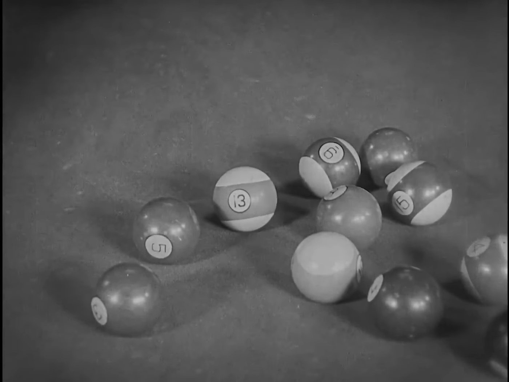
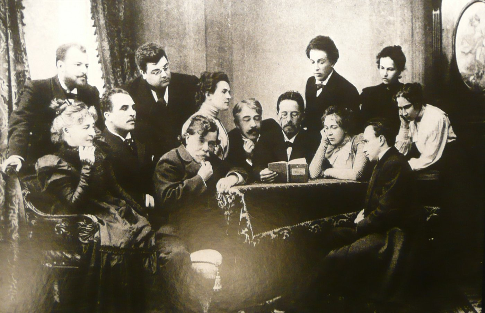

> Spotted: Trey Parker and Matt Stone crashing a writing class at NYU.

September 6, 2011. NYU Tisch, a course called Storytelling Strategies, filmed for an MTV show. The South Park guys walked in and taught it.

Parker gave the room one rule, and said they had maybe heard it before. Write your beats down. If AND THEN fits between two of them, you have something boring. Between every beat goes BUT or THEREFORE.

He was right that it is old. Aristotle's Poetics already says it matters whether a thing happens because of the last thing, or just after it.

## Show them the bomb

Hitchcock to Truffaut, August 1962. Two people talk at a table and a bomb goes off. That is fifteen seconds of surprise. Now show the audience the bomb first, and the clock. Same boring chat, fifteen minutes of suspense.

Hitchcock said on the tapes that it was not new. David Bordwell traced it to Lessing's notes on drama from 1767. And Buster Keaton put a bomb on a pool table in 1924.

The exploding 13 ball in Sherlock Jr., Buster Keaton, 1924, public domain, via [Wikimedia Commons](https://commons.wikimedia.org/wiki/File:Sherlock_Jr._%281924%29.webm).

## Every scene wants something

David Mamet once sent a memo to the writers of The Unit, in all capitals. Ask every scene three things. Who wants what. What happens if they don't get it. Why now.

Aaron Sorkin says the same thing shorter. "I worship at the altar of intention and obstacle." He told Interview in 2012 that he cannot write a scene until he knows what somebody wants and what is stopping them.

## But do not repeat what you heard

You heard Chekhov said a gun on the wall in act one has to go off in act three. What he wrote, in a letter in 1889, is that you do not put a loaded rifle on stage if nobody means to fire it. The pistol on the wall is how a friend, Ilia Gurlyand, remembered a talk with him. It was printed in 1904. None of the versions say act three.

Anton Chekhov reads The Seagull to the Moscow Art Theatre company, unknown photographer, 1899, public domain, via [Wikimedia Commons](https://commons.wikimedia.org/wiki/File:Chekhov_and_the_Moscow_Art_Theatre_1899.jpg).

You heard about Pixar's 22 rules. They are tweets from 2011 by Emma Coats, a Pixar story artist at the time. She never called them rules, or Pixar's.

## So go write in Austin

Wes Anderson and Owen Wilson met in a playwriting class at UT Austin in 1989. Their Bottle Rocket short played Sundance in 1993, and festival staff took Anderson for a volunteer while he hung his own poster.

The Austin Film Festival and Writers Conference opens October 29. One of this year's honorees is Brad Bird, the man behind The Incredibles.

Thursday October 29. Austin Film Festival and Writers Conference, Austin.

Next in THE CRAFT: What The Director Whispered.

Spotted something? [Tell the desk](https://0fftheprint.com/#take). Off the record stays off the record.
