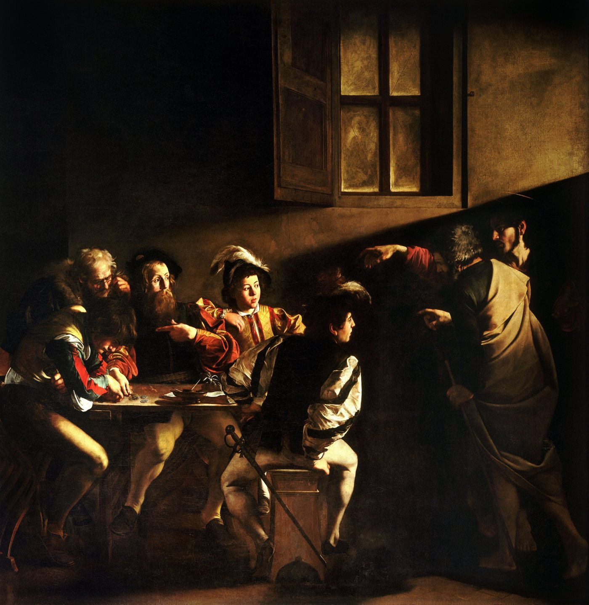
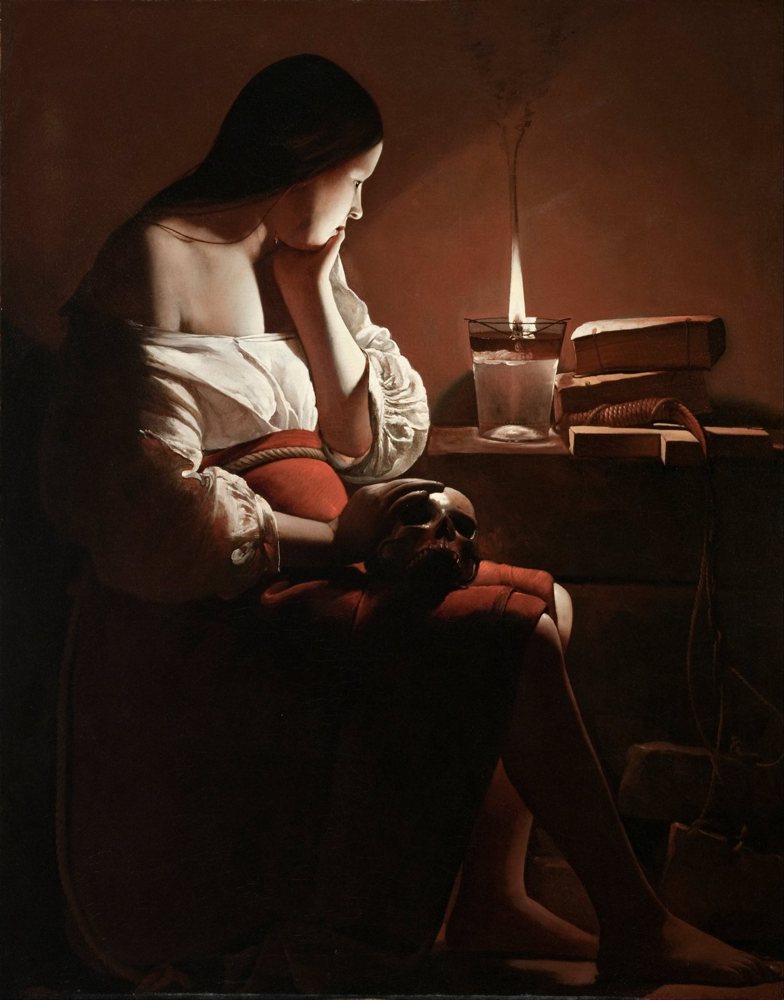

> Spotted: Emmanuel Lubezki's crew building a wall to block out the moon.

Night shoot on The Revenant. A campfire. A strange light kept landing on the actors' faces and wrecking the shots. Lubezki asked over the radio for somebody to switch it off. It was the full moon. So the crew built a wall behind the camera, 40 feet by 30, to hide it. He told British Cinematographer in 2016.

That is the whole game. Every light on screen is pretending to be something. Your job is to keep its story straight.

## Give every light an alibi

Roger Deakins lit the night town in 1917 with two things. Flares on crane wires that burned 22 to 30 seconds each, and a fake burning church. The church was a rig 50 feet high with about 2,000 bulbs on dimmers. He told American Cinematographer the fire and a few flares were the only sources.

His fire trick is cheap. A plain tungsten bulb run at 20 to 30 percent goes orange and reads as flame.

Vittorio Storaro says his eye changed in a small church in Rome, in front of Caravaggio. One beam across the room. Everything else left dark.

The Calling of Saint Matthew, Caravaggio, 1599 to 1600, public domain, via [Wikimedia Commons](https://commons.wikimedia.org/wiki/File:The_Calling_of_Saint_Matthew-Caravaggo_%281599-1600%29.jpg).

## But do not repeat what you heard

You heard Kubrick shot Barry Lyndon on a lens NASA built for the dark side of the moon. Zeiss made that lens, and Zeiss says "There is no evidence to support the myth". Ten were made. Six went to NASA. Kubrick ended up with three.

The candles were real. Three wicks each, a key around 3 foot-candles, the whole film pushed a stop in the lab. But a lot of the famous daylight in those rooms was movie lamps outside the windows, shining through tracing paper.

You heard The Revenant was natural light only. Lubezki says natural light for the vast majority. At one windy campfire he slipped in a steady light on a dimmer and let the real fire flicker over it.

The Magdalen with the Smoking Flame, Georges de La Tour, circa 1635 to 1637, public domain, via [Wikimedia Commons](https://commons.wikimedia.org/wiki/File:Georges_de_La_Tour_-_The_Magdalen_with_the_Smoking_Flame_-_Google_Art_Project.jpg).

## So be early

Days of Heaven is set in the Texas Panhandle in 1916 and was shot mostly at the end of the day. Its cinematographer, Néstor Almendros, wrote that sunset to full dark is only about twenty minutes. So they shot about twenty minutes a day.

In San Antonio on Saturday October 17 the sun sets at 7:01 PM and civil twilight runs out at 7:25. Be framed by 6:30. That is your window.

Saturday October 17, San Antonio. Sunset 7:01 PM. Bring one light and a reason for it.

Next in THE CRAFT: The Lightsaber Was A Projector.

Spotted something? [Tell the desk](https://0fftheprint.com/#take). Off the record stays off the record.
