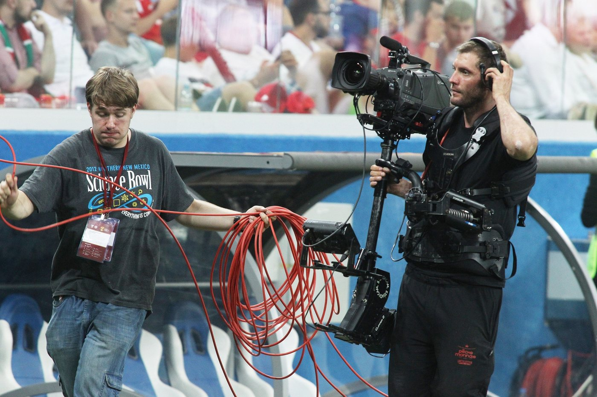
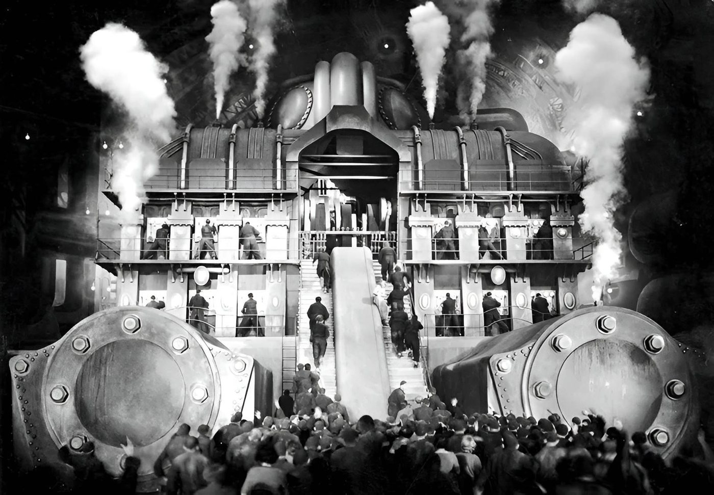

> Spotted: Karl Freund riding a bicycle through a hotel lobby, movie camera on board.

That was 1924, The Last Laugh. Freund steered the bike and the camera rode it across the lobby to the revolving doors. For the drunk dream he strapped the camera to his chest and the batteries to his back. Criterion calls it the first time a moving camera was fully worked into how a movie got made.

A hundred years later anybody can move a camera. The masters mostly don't.

## Move it for a reason or leave it alone

"If the camera moves it's got to be for a reason." That is Roger Deakins to Hazlitt in 2015. Then he told everybody to go watch Bresson.

When the camera does move, it follows something. Kubrick needed to chase a kid on a Big Wheel through the Overlook Hotel. So Garrett Brown ran the Steadicam from a wheelchair to keep up.

A Steadicam operator and his cable assistant at a football match, by Runner1616, via [Wikimedia Commons](https://commons.wikimedia.org/wiki/File:Steady_Sport.jpg), [CC BY-SA 4.0](https://creativecommons.org/licenses/by-sa/4.0). Resized.

## Center it on purpose

You were told never to center anything. Put it on a third. James Cutting at Cornell went through almost 14,000 frames from 48 popular movies, 1935 to 2010. Single characters landed in the thirds zones 19 percent of the time. He wrote that the numbers are not strong evidence for the rule.

Wes Anderson centers everything. His cinematographer, Robert Yeoman, has an assistant measure from the lens to the corners of the room so the camera sits dead center. Yeoman reckons at least 90 percent of Rushmore and The Royal Tenenbaums was one 40mm lens.

The machine set of Metropolis, Horst von Harbou, 1926, public domain, via [Wikimedia Commons](https://commons.wikimedia.org/wiki/File:Horst_von_Harbou_-_Metropolis_set_photograph_20.jpg).

## But do not repeat what you heard

You heard Birdman was one take. Its cinematographer, Emmanuel Lubezki, told ARRI he did not want to do the movie in one shot. Rodeo FX built around 100 stitches between the long takes.

You heard Hitchcock shot Rope in one take. A magazine of film back then held a little over ten minutes. One take was physically impossible. Every other join hides on the back of a jacket.

The real one is Russian Ark. One Steadicam take through the Hermitage on December 23, 2001. The first three tries died early. The fourth went all the way.

## So go see where it started

Murnau, who directed The Last Laugh, made Faust two years later. Alamo Drafthouse Park North is showing it with a live score by The Invincible Czars. Austin gets the same show two nights later at AFS Cinema.

And the man who centers everything is ours. Wes Anderson was born in Houston and met Owen Wilson in a playwriting class at UT Austin.

Monday November 2, 7 PM. Faust with a live score, Alamo Drafthouse Park North, San Antonio.

Next in THE CRAFT: Every Light Needs An Alibi.

Spotted something? [Tell the desk](https://0fftheprint.com/#take). Off the record stays off the record.
