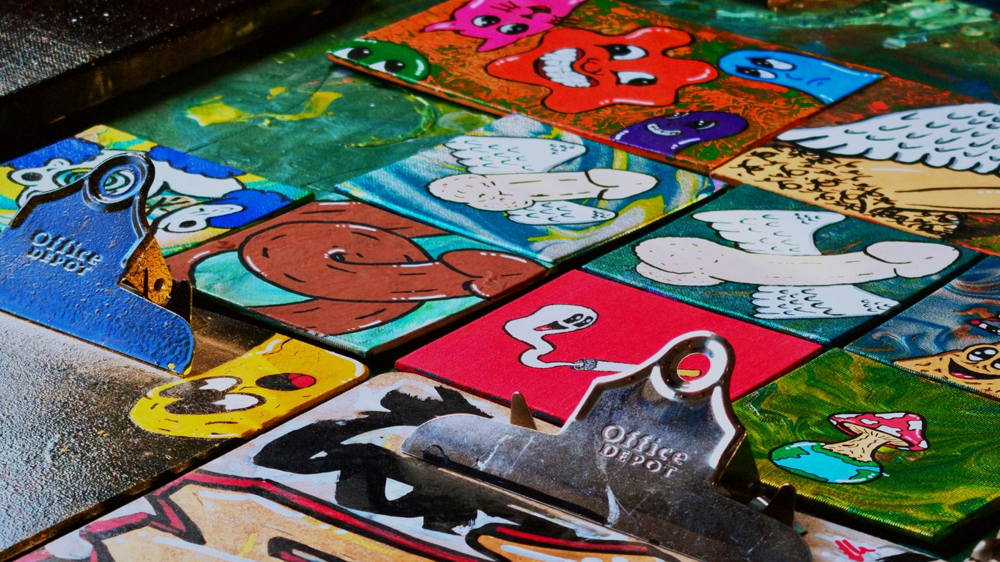

Rah Rah Room on a Sunday night. A vendor market with hand painted skate decks and prints and earrings on folding tables, the usual Sunday craft fair setup, except roughly one person in six is in full clown paint and nobody is treating that as remarkable.

That ratio is the whole thing. A room full of clowns is a circus, and you already know how to feel about a circus. A room where most people came in a t-shirt and a handful came in greasepaint is something else. It reads like a pep rally. Everybody is in on it and nobody is performing at you.

## The market came first

Two hours of tables. Sticker sheets, decks painted edge to edge, jewellery hung off pegboard, a print booth run by somebody in full white face who was also, clearly, just working their booth. People buying things, people not buying things, people leaning on the bar at the back.

The paint stops at the jaw on most of them. That is what somebody who did it themselves in a bathroom looks like, as opposed to somebody who got made up for a job.

## Then it turned into a show

At some point the tables came down, a banner went up across the back of the stage reading GO CLOWNS GO, and the same crowd that had been shopping sat down to watch a comedy set. One person on a mic under a magenta wash, then two, then a bit that needed a lawn chair.

Later the whole cast came out and lined up across the stage. Nine people, most in shorts and a shirt they already owned, one in full paint at the end of the row, everybody holding a drink. It is the single most accurate photograph of the night, which is why it is at the top of this page.

## Then a band

Fog, a guitar, red on everything. The room went from seated to standing without anybody announcing it. This is the part where the night stops being a market and remembers it is a bar.

## Then somebody got body slammed

The patio out back had a mat on it, a referee in stripes with a red nose, a hand lettered sign, and two men wrestling in front of about forty people standing in a ring around them. It went on for a while. There was a count, there was a celebration, then there was more of it.

Nothing at the door suggested any of this was going to happen.

## Where it lives

Forty frames from the night are up at full quality and free to download, and eight clips are up straight off the night, uncut. If you were there you are probably in one of them.

Rah Rah Room, Sunday 30 August 2026, seven in the evening until eleven. One camera, no flash, the room lit exactly the way the room lights itself.
