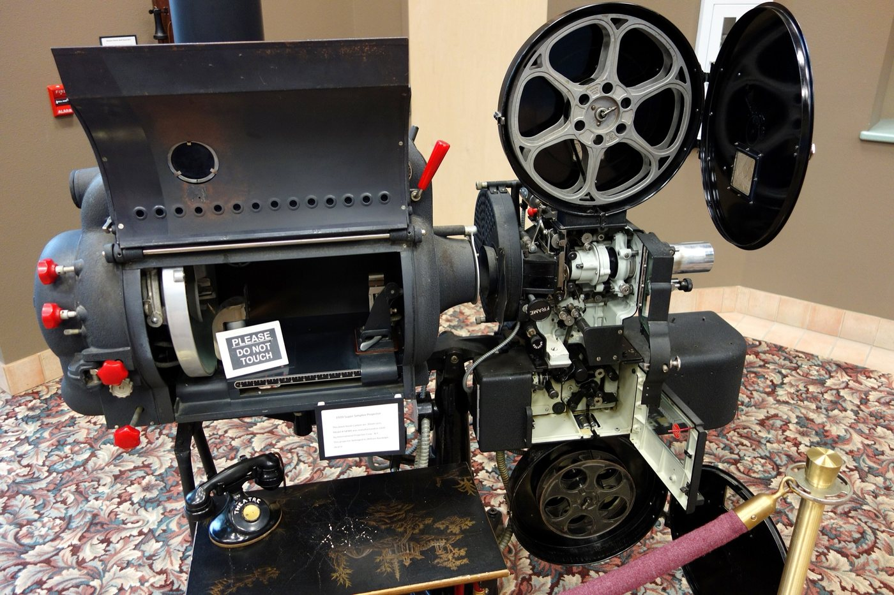
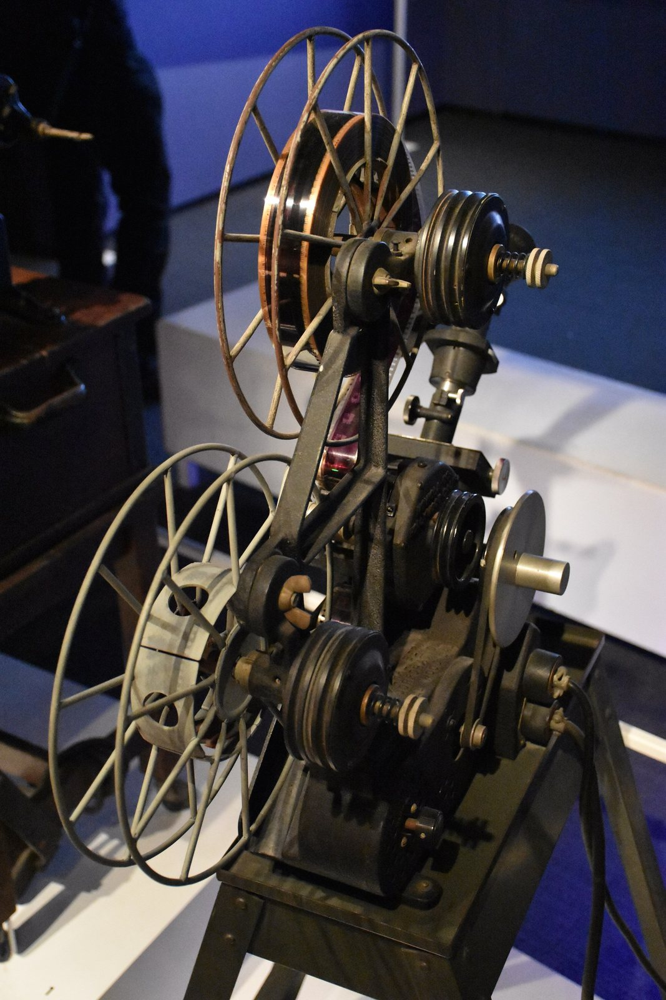

> Spotted: Ben Burtt taping a movie projector in a USC booth.

He was a grad student and a projectionist. The booth had some very old Simplex projectors, and when the motors idled they hummed. Then he carried a microphone past a TV that was on with the sound down, and it caught a buzz off the picture tube. He mixed the two about fifty fifty.

That is the lightsaber. To make it swing he played the tone through a speaker and waved a second microphone past it. He has said it was the first sound he made for Star Wars.

A 1939 Super Simplex projector at Hearst Castle, California, by Daderot, via [Wikimedia Commons](https://commons.wikimedia.org/wiki/File:1939_Super_Simplex_Projector,_Model_No._58980,_made_by_International_Projector_Corp.,_owned_by_William_Randolph_Hearst_-_Hearst_Castle_-_DSC07053.JPG), [CC0](https://creativecommons.org/publicdomain/zero/1.0/).

## Cut for the feeling

Walter Murch ranks what a cut has to do. Emotion 51 percent. Story 23. Rhythm 10. Eye trace 7. The flat plane of the screen 5. Three dimensional space 4. That is his Rule of Six, from In the Blink of an Eye. Emotion outweighs the other five combined. So if the cup jumps hands but the face is right, keep the face.

He cuts standing up about half the time, at an old drafting desk. Partly habit from the upright Moviola, partly because he says standing gives him a better sense of time.

A Moviola Model D editing machine (1927) at the Museum of the Moving Image, New York, by HaeB, via [Wikimedia Commons](https://commons.wikimedia.org/wiki/File:Moviola_Model_D_%28MOMI%29.jpg), [CC BY-SA 4.0](https://creativecommons.org/licenses/by-sa/4.0/). Resized.

On Apocalypse Now he got a screen credit as Sound Designer, which Variety calls a film first. The helicopter attack ran on more than 175 separate soundtracks. For The English Patient he won the editing Oscar and the sound Oscar for the same film.

## But do not repeat what you heard

You heard George Lucas said sound is 50 percent of the movie. Try to find where. The line floats around in a few different wordings, with no interview and no year attached.

The director on camera saying it is David Lynch. In a clip about his sound man Alan Splet, he calls sound 50 percent of the picture.

## So cut like you are broke

Robert Rodriguez was born in San Antonio. He shot El Mariachi in August 1991 and spent $7,225 of the $9,000 he raised. He wanted the buyer to think it cost $70,000, so he made it look big with action and cuts.

David Bordwell clocks it at 2.3 seconds a shot. Same as Armageddon. When Columbia picked it up, Rodriguez said the studio logo "probably cost more than my whole movie."

Then go hear what Lynch meant. Wild at Heart is back in a new 4K restoration, and Alamo Drafthouse Park North has it.

Wednesday November 4, 7:30 PM. Wild at Heart, Alamo Drafthouse Park North, San Antonio.

That is THE CRAFT, all five.

Spotted something? [Tell the desk](https://0fftheprint.com/#take). Off the record stays off the record.
