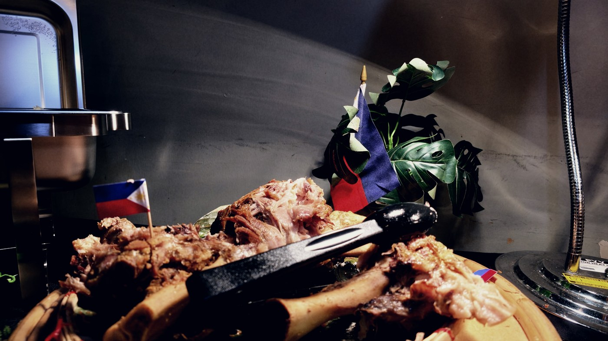
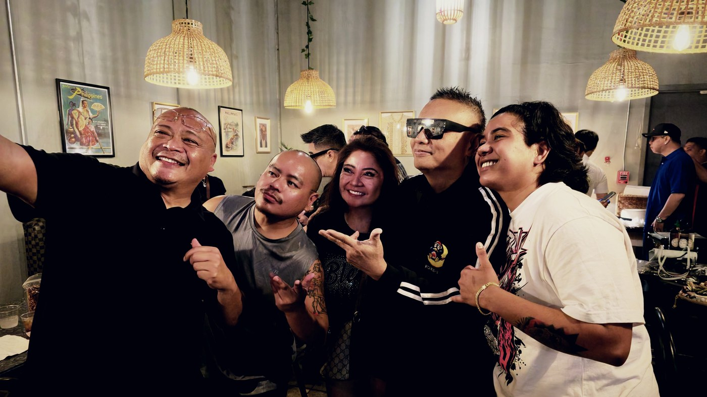

Andrew E. played Stable Hall on a Saturday night. It was the first time he had ever performed in Texas. The next afternoon he was on the South Side eating pancit off a buffet tray at Sari-Sari, and he sat down with us for ten questions while his crew ate around him.

He is thirty five years into this. In 1990 he put out Humanap Ka Ng Panget and dragged rap onto Philippine radio, which at the time did not have a word for what he was doing. Fourteen albums, thirty five films, a label he started in 1997. He is a large part of the reason a Filipino rap record is a normal thing to own.

None of that is how the conversation started. It started with food.

## The only Bicolano who cannot swim

His father is from Bula, in Camarines Sur. The man who founded the restaurant is from Naga, the next town over, which is the sort of coincidence that stops being a coincidence once you have been in enough Filipino rooms. He was born and raised in Parañaque on his mother's side, but the Bicol is in there, and so is the tolerance for heat that comes with it.

> I am the only Bicolano who does not know how to swim

He was still laughing at himself when the next question landed. Asked what he eats first when he gets home, he did not have to think. Pancit. He had spotted it in the line the night before and gone back for it, and said he spent the next day hoping there would be more waiting for him. There was.

Then we asked whether a dish only tastes right when a Filipino makes it far from home, and he refused the premise.

{poster=delicious.jpg}

## What San Antonio sounded like

We asked him what the city sounded like the night before. He did not hedge.

{poster=loudest.jpg}

The explanation was better than the compliment. Nobody in that room came to a concert, he said. They came to show love, and he gave it back. Thirty five years in, he knows the difference between an audience and a turnout.

He also has a rule about touring that explains why he was in Texas at all. Wherever he goes, it has to be somewhere he has not been. He played Japan enough times that he started choosing Taiwan instead, then Hong Kong. The same rule put him here.

{poster=handpick.jpg}

He could have gone to Houston. He could have gone to Dallas.

## The longing is the difference

The longest answer of the afternoon came from asking how crowds out here compare to crowds back home. The energy is the same, he said. The longing is not.

People here miss the Philippines whether or not there is a show, so when someone comes over from Manila the missing gets louder rather than quieter. Then he drew a line only somebody who has played to both would draw. The people in that room have their families with them while they work. Overseas workers who send everything home and live alone do not. That, he said, is what makes it sweeter here.

There was a nine year old at the show the night before who knew every word of a song he put out in 1991. He is still turning that one over.

## They will think you are a lunatic

Before any of it he was DJing at Euphoria in 1988, earning two thousand pesos a month. Ramon Jacinto's daughter was a regular, heard him rap, and told her father there was someone he ought to hear. Somebody came around for a demo tape. He handed it over and told them he was quitting anyway.

They signed him for a whole album.

{poster=euphoria.jpg}

Ask him who told him rapping in Tagalog would not work and he corrects the question. Nobody needed to. Rapping in English would not have worked either, because rap did not exist there yet. Not a genre, not a word anyone could define, nothing in the dictionary and nobody around to explain it.

{poster=lunatic.jpg}

A man walking down the road talking to nobody, he said, and people would assume he needed a hospital. Then he made the whole country learn the word. He is still amused about it.

> Up until now they say I am crazy

## The last question

We asked what he tells the kids who watched him the night before and want to do what he does. He had this one loaded.

{poster=believe.jpg}

His reasoning, not ours: if the world can see that you do not believe in yourself, the world has no reason to believe in you either. Get that part right and the rest follows.

Then he asked whether we wanted to keep going, said he would be there until two in the morning, and recorded a thank you to San Antonio off his own bat, because that was the part he actually cared about.

## Credits

Shot at Sari-Sari on the South Side, Sunday 30 August 2026, the day after the Stable Hall show. Two cameras, no lights, the room exactly as it was. Andrew E. saw the cut before you did. House rule.
