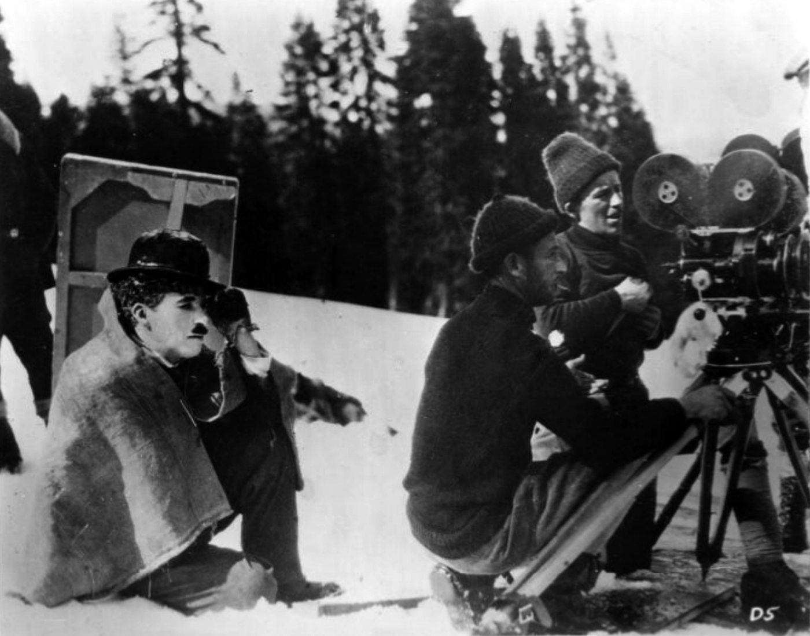

> Spotted: Sidney Lumet refusing to call cut on Al Pacino.

You want the performance. So does everybody. Here is how the masters actually get it, with receipts.

Dog Day Afternoon, 1975. The phone call near the end. Two cameras rolling. Pacino finished the take and Lumet did not even cut the camera. He told him to go again, right now. Where Pacino ended the first take was where Lumet wanted the scene to begin. Lumet told that story to Terry Gross on Fresh Air in 1988.

## Rehearse it like a play

Lumet rehearsed two to three weeks before shooting. Lines learned, no scripts in hand, blocked like theater. Then he guarded the first takes. "The early takes are not imperfect. They are usually the freshest, truest."

Clint Eastwood goes further. He told Film Comment in 2005 he tries to get it the very first time, so every line sounds like the first time it is said.

Richard Linklater rehearses three weeks and calls it essential. He finds the movie in the writing and the rehearsing. The shoot is the last phase. He never does reshoots.

Charlie Chaplin with his camera crew on The Gold Rush (1925), public domain, via [Wikimedia Commons](https://commons.wikimedia.org/wiki/File:Charlie_Chaplin_and_camera_crew_in_The_Gold_Rush.jpg).

## Give them a verb, not a feeling

Never tell anybody to be sad. Judith Weston, whose book Directing Actors came out in 1996, says work the process, not the result. Her tools are verbs, facts, images and events. Ask questions. Build on what they bring.

And when the note is personal, give it alone. On The Verdict, Lumet kept Paul Newman back after a flat run-through. He told him part of the man was still missing, and only Newman could choose to show it. He said he would not invade his privacy. The next rehearsal came alive.

## But do not repeat what you heard

You heard Kubrick made Shelley Duvall swing that bat 127 times. Lee Unkrich holds the complete shot logs for The Shining. He told IndieWire in 2023 no setup of the bat scene went past 15 takes. The most for any one shot was 66, the long dolly into the Gold Ballroom.

You heard Chaplin shot the City Lights flower girl scene 342 times. That is the Guinness number. Historian Jeffrey Vance went through the continuity reports and counted over 200. Still a lot. Still not 342.

Two of the most famous take counts in film came from memory. Both shrink when somebody opens the paperwork.

## So count them yourself

AFS Cinema, run by the Austin Film Society that Linklater founded in 1985, is screening The Shining this week. Watch the staircase and do the math.

Then put on Dazed and Confused. Top Notch on Burnet Road is where McConaughey first said alright, alright, alright.

Thursday October 8 at 7:45 PM and Saturday October 10 at 7:30 PM. AFS Cinema, 6406 N I-35, Austin.

Next in THE CRAFT: It Was Never One Take.

Spotted something? [Tell the desk](https://0fftheprint.com/#take). Off the record stays off the record.
